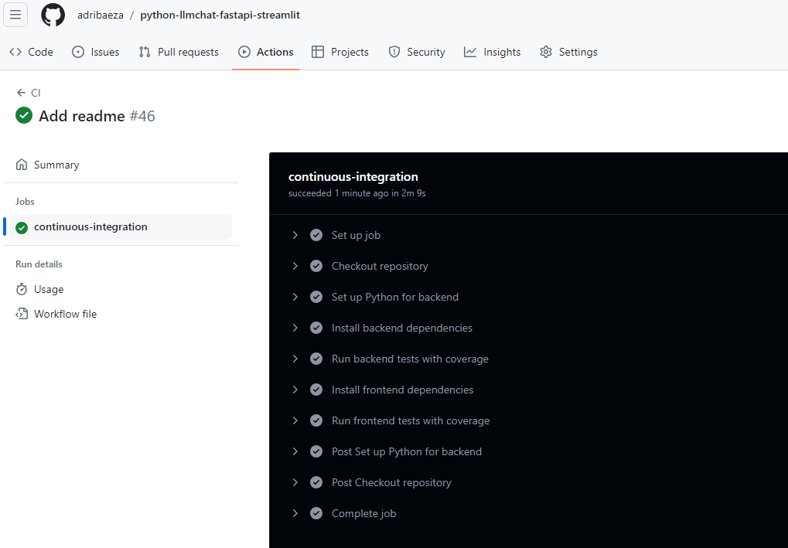
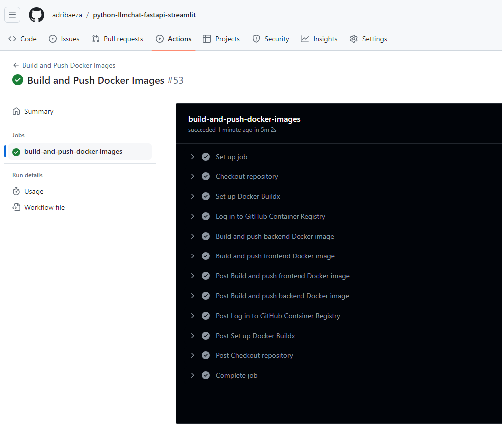
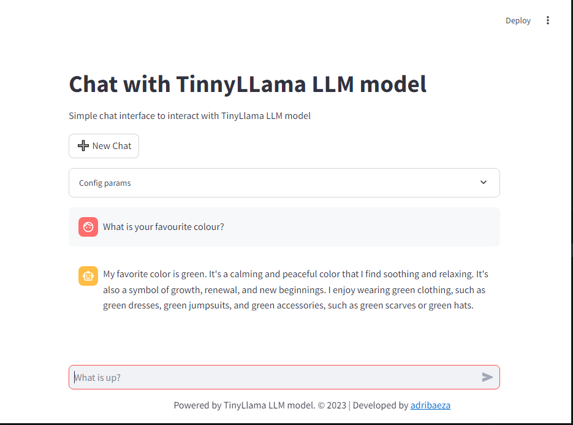
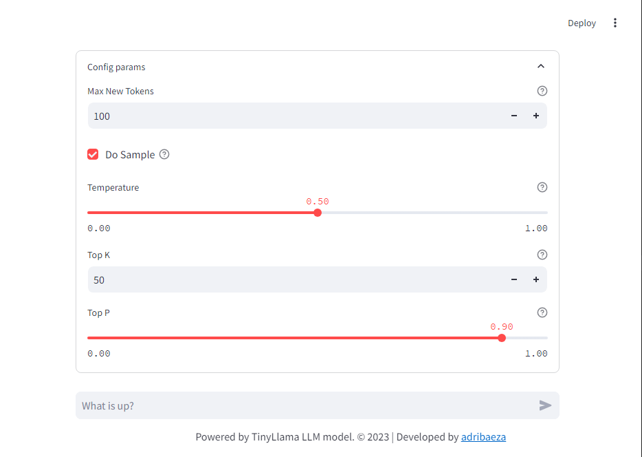

# Chat Assistant with Streamlit and FastAPI


This project is a chat application with a web interface developed using Streamlit and a backend developed with FastAPI. The backend integrates and loads the TinyLlama model directly to handle chat queries and generate responses to users' questions. The entire solution is containerized, allowing for deployment with both Docker Compose and Kubernetes.

## Contents

- [Features](#features)
- [Technologies, Frameworks and Tools](#technologies-frameworks-and-tools)
- [GitHub Actions CI/CD](#github-actions-cicd)
- [Architecture](#architecture)
- [Project Structure](#project-structure)
  - [Backend](#backend)
  - [Frontend](#frontend)
  - [Root Directory](#root-directory)
- [Getting Started](#getting-started)
   - [Prerequisites](#prerequisites)
   - [Installation for Local Development](#installation-for-local-development)
   - [Frontend usage](#frontend-usage)
   - [Backend API Usage](#backend-api-usage)
   - [Building the Docker Image Locally](#building-the-docker-image-locally)
   - [Running the Docker Image Locally](#running-the-docker-image-locally)
   - [Deployment with Docker Compose](#deployment-with-docker-compose)
   - [Deployment with Kubernetes](#deployment-with-kubernetes)
- [Running Tests](#running-tests)
- [Documentation](#documentation)
- [Contributing](#contributing)
- [License](#license)

## Features

- Chat Interface with TinyLlama Model: The chat interface uses a TinyLlama model integrated within the backend to respond to user queries in natural language format with a conversational tone and context. The model is not hosted on Hugging Face but is instead downloaded and loaded directly in the backend for real-time response generation. View the [TinyLlama model](https://huggingface.co/TinyLlama/TinyLlama-1.1B-Chat-v1.0).
- Web interface developed with Streamlit. The user can interact with the chatbot and view the responses in real-time. View the [Streamlit documentation](https://docs.streamlit.io/).
- Backend API developed with FastAPI. The API handles the chatbot logic and interacts with the TinyLlama model to generate responses. View the [FastAPI documentation](https://fastapi.tiangolo.com/).
- Containerized images with Docker
- Deployment option with Docker Compose
- Deployment option with Kubernetes. 

## Technologies, Frameworks and Tools

- Streamlit (python)
- FastAPI (python)
- Docker
- Kubernetes

## Gihub Actions CI/CD

With GitHub Actions, you can automate your workflow from idea to production. You can build, test, and deploy your code right from GitHub.
In this project, you can find the following workflows (only available with each change in the main branch):

- **CI**: This workflow runs the unit tests (with pytest dependency) for the backend and frontend applications. This workflow is triggered when changes are pushed to the main branch

   

- **Build and Push Docker Images**: This workflow builds the Docker images for the backend and frontend applications and pushes them to GitHub Container Registry.  This workflow is triggered when the CI workflow passes successfully. You can find  images in the following public registries:
    
    - [Backend Docker Image](https://github.com/users/adribaeza/packages/container/package/llm-tinyllama-backend)
      
      ```bash
      docker pull ghcr.io/adribaeza/llm-tinyllama-backend:latest
      ```

    - [Frontend Docker Image](https://github.com/users/adribaeza/packages/container/package/llm-tinyllama-frontend)
      
      ```bash
      docker pull ghcr.io/adribaeza/llm-tinyllama-frontend:latest
      ```

      

## Architecture

The architecture of the chat assistant application is designed to be modular and scalable. The application is divided into two main components: the frontend and the backend.

**Frontend (Streamlit):**

Developed with Streamlit, it provides the user interface for interacting with the chatbot.
Users can send chat messages and receive responses through the frontend interface.

**Backend (FastAPI):**

Developed with FastAPI, it handles the chatbot logic and interactions with the TinyLlama model.
The TinyLlama model, a conversational language model, is downloaded and loaded within the backend to generate real-time responses.
The backend exposes an API that the frontend uses to send chat messages and receive responses from the chatbot.
Both components, frontend and backend, are containerized with Docker and can be deployed using Docker Compose or Kubernetes. This separation allows for independent scaling and deployment of each part of the application.

**Communication:**

The frontend communicates with the backend via HTTP POST requests, sending chat messages to the backend and receiving responses generated by the TinyLlama model. The TinyLlama model is not hosted externally but is directly integrated and loaded within the backend to provide real-time responses.

The application is designed to be user-friendly and interactive, allowing users to chat with the chatbot and view responses immediately. It can be deployed on local machines or in the cloud using Docker Compose or Kubernetes.

**Architecture Diagram:**

```
+--------------------------------------+
|               Docker                 |
|                                      |
| +-------------+      +-------------+ |
| |  Frontend   |      |   Backend   | |
| | (Streamlit) | <--->|  (FastAPI)  | |
| +-------------+  HTTP|  +---------+ | |
|                       |  | TinyLlama | |
|                       |  | (Modelo)  | |
|                       |  +---------+ | |
| +----------------------------------+ |
|     Docker Compose / Kubernetes      |
+--------------------------------------+
```

## Project Structure

The project structure is organized into two main directories: `backend` and `frontend`. In root directory, you can find the configuration files and documentation for the overall project.

The project structure is designed to separate the backend and frontend components of the application, making it easier to manage and deploy each part independently. The `backend` directory contains the FastAPI application code, while the `frontend` directory contains the Streamlit application code. The root directory contains common configuration files and documentation for the entire project.

### Backend

The `backend` directory contains everything related to the FastAPI application. Here's the structure of the `backend` directory:

```
backend/
├── api/
│ └── main.py
├── k8s/
│ ├── deployment.yaml
│ └── service.yaml
├── tests/
│ └── test_main.py
├── .env
├── Dockerfile
├── Readme.md
├── requirements.txt
```

#### Files

- **api/main.py**: This is the main file for the FastAPI application. It's where the API is defined and the language model is loaded.
- **k8s/deployment.yaml**: This is the Kubernetes configuration file for the backend Deployment.
- **k8s/service.yaml**: This is the Kubernetes configuration file for the backend Service.
- **tests/test_main.py**: This file contains test cases for the FastAPI application.
- **.env**: Environment variables for the backend application.
- **Dockerfile**: This file defines how the Docker image for the FastAPI application is built.
- **requirements.txt**: This file lists the Python dependencies required for the FastAPI application.

### Frontend

The `frontend` directory contains everything related to the Streamlit application. Here's the structure of the `frontend` directory:

```
frontend/
├── app/
│ └── main.py
├── k8s/
│ ├── deployment.yaml
│ └── service.yaml
├── tests/
│ └── test_main.py
├── .env
├── Dockerfile
├── Readme.md
├── requirements.txt
```

#### Files

- **app/main.py**: This is the main file for the Streamlit application. It's where the user interface is defined and interacts with the backend API.
- **k8s/deployment.yaml**: This is the Kubernetes configuration file for the frontend Deployment.
- **k8s/service.yaml**: This is the Kubernetes configuration file for the frontend Service.
- **tests/test_main.py**: This file contains test cases for the Streamlit application.
- **.env**: Environment variables for the frontend application.
- **Dockerfile**: This file defines how the Docker image for the Streamlit application is built.
- **Readme.md**: Documentation file for the frontend application.
- **requirements.txt**: This file lists the Python dependencies required for the Streamlit web application.

### Root Directory

The root directory contains configuration files and documentation for the overall project:

```
├── .github/
├── .gitignore
├── docker-compose-ghimages.yaml
├── docker-compose.yml
├── pytest.ini
├── README.md
```

#### Files

- **.github/**: Contains GitHub configuration files. Includes workflows for CI/CD integration with GitHub Actions.
- **.gitignore**: Git ignore file.
- **docker-compose-ghimages.yaml**: Docker Compose configuration for run the services with GitHub Container Registry images.
- **docker-compose.yml**: Docker Compose configuration file for Build Docker images and run the services.
- **pytest.ini**: Configuration file for pytest. Example: exclude directories from testing, set verbosity, etc.
- **README.md**: Main documentation file for the project.


## Getting Started

### Prerequisites

- Docker. If you deploy solution in your machine, you can download Docker Desktop from the [Docker website](https://www.docker.com/products/docker-desktop).
- Kubernetes. You can enable Kubernetes in Docker Desktop by going to Preferences > Kubernetes > Enable Kubernetes in your machine if you want to deploy the solution in Kubernetes locally.
- Python 3.8+. You can download it from the [Python website](https://www.python.org/downloads/).
- FastAPI. View installation instructions in the [FastAPI documentation](https://fastapi.tiangolo.com/). Not necesary if you install dependencies by requirements.txt file.
- Streamlit. View installation instructions in the [Streamlit documentation](https://docs.streamlit.io/). Not necesary if you install dependencies by requirements.txt file.

### Installation for Local Development

1. Clone the repository:

   ```bash
   git clone https://github.com/adribaeza/python-llmchat-fastapi-streamlit.git
   cd python-llmchat-fastapi-streamlit
    ```
2. Install the required dependencies:

   ```bash
   pip install -r backend/requirements.txt
   pip install -r frontend/requirements.txt
   ```
3. Set SERVICE_TOKEN environment variable with the service token for the backend API. You can set the environment variable in the terminal before running the application:

   (Linux/Mac)
   ```bash
   export SERVICE_TOKEN="myllservicetoken2024"
   ```
   or

   (Windows)
   ```bash
   $env:SERVICE_TOKEN="myllservicetoken2024"
   ```

4. Run the backend FastAPI application:

   ```bash 
    uvicorn backend.api.main:api --reload
    ```
5. Run the frontend Streamlit application:

   ```bash
   streamlit run frontend/app/main.py
   ```
6. Open your web browser and go to `http://localhost:8501` to access the Streamlit application Chat of the frontend.

7. Go to `http://localhost:8000/docs` to access the FastAPI Swagger documentation of the backend.

### Frontend usage

1. Enter your message in the chat interface on the Streamlit application.
2. Click the "Send" button to send the message to the backend API.
3. The backend API will process the message and generate a response using the TinyLlama model.
4. The response will be displayed in the chat interface on the Streamlit application.



From the frontend interface, you can interact with the chatbot and view the responses in real-time. The backend API handles the chatbot logic and interacts with the TinyLlama model to generate responses.

You can adjust the following parameters in the Streamlit interface to control the chatbot responses  expand the "Config params" section:
- **Max Tokens**: The maximum number of tokens to generate.
- **Temperature**: The value used to control the randomness of the generated text.
- **Top K**: The number of highest probability vocabulary tokens to keep for top-k-filtering.
- **Top P**: The cumulative probability of parameter settings for nucleus sampling.



The interface send all history of the chat to the backend API to generate the response. LLM model is a conversational model, so it needs the context of the conversation to generate the response correctly.

For clear the chat history, you can click the "New Chat" button.

### Backend API Usage

The backend API is a FastAPI application that handles the chatbot logic and interacts with the TinyLlama model to generate responses. The API exposes the following endpoints:

- **POST /api/v1/chat**: This endpoint receives a chat messages from the frontend and generates a response using the TinyLlama model. View swuaager documentation in `http://localhost:8000/docs` for more information.

- **GET /docs**: This endpoint provides the Swagger documentation for the backend API. You can access it by going to `http://localhost:8000/docs` in your web browser.


### Building the Docker Image Locally

To build the Docker image for the backend FastAPI application, run the following command:

```bash
docker build -t llm-tinyllama-backend:latest backend
```

To build the Docker image for the frontend Streamlit application, run the following command:

```bash
docker build -t llm-tinyllama-frontend:latest frontend
```

#### Accessing the Services

- To access the frontend in Docker, go to:

   ```bash
    http://localhost:8501
   ```
- To access the backend in Docker, go to:

   ```bash
    http://localhost:8000/docs
   ```
**Note**: You can wait a few minutes for the bakcend load the TinyLlama model and be ready to receive requests.

### Running the Docker Image Locally

To run the Docker image for the backend FastAPI application, run the following command:

```bash
docker run -d -p 8000:8000 llm-tinyllama-backend:latest
```

To run the Docker image for the frontend Streamlit application, run the following command:

```bash
docker run -d -p 8501:8501 llm-tinyllama-frontend:latest
```

To stop the Docker containers, run the following command:

```bash
docker stop <container_id>
```

Replace `<container_id>` with the actual container ID of the running container.

### Deployment with Docker Compose 

#### Pre-requisites

- Docker Desktop installed on your machine. You can download it from the [Docker website](https://www.docker.com/products/docker-desktop).

#### Deploy Options

There are two Docker Compose files available for deployment (choose one):

- `docker-compose.yml`: This file builds the Docker images for the backend and frontend applications and runs the services.
- `docker-compose-ghimages.yaml`: This file pulls the Docker images from GitHub Container Registry and runs the services.

##### Option 1: Build Docker Images with Docker Compose

To deploy the services with Docker Compose, follow these steps:

1. Build and run the services:

   ```bash
   docker-compose up
   ```
2. Stop the services:

   ```bash
    docker-compose down
    ```

##### Option 2: GitHub Container Registry Images with Docker Compose

To deploy the services with Docker Compose using GitHub Container Registry images, follow these steps:

1. Run the following command:

   ```bash
   docker-compose -f docker-compose-ghimages.yaml up
   ```
2. Stop the services:

   ```bash
    docker-compose -f docker-compose-ghimages.yaml down
    ```

#### Accessing the Services

- To access the frontend in Docker Compose, go to:

   ```bash
    http://localhost:8501
   ```
- To access the backend in Docker Compose, go to:
   
   ```bash
   http://localhost:8000/docs
   ```

**Note**: You can wait a few minutes for the bakcend load the TinyLlama model and be ready to receive requests.
 
### Deployment with Kubernetes

#### Pre-requisites

- Install Docker Desktop with Kubernetes enabled. You can enable Kubernetes in Docker Desktop by going to Preferences > Kubernetes > Enable Kubernetes.

#### Steps

There are Kubernetes configuration files available for deployment:

- `backend/k8s/deployment.yaml`: This file defines the Kubernetes Deployment for the backend FastAPI application.
- `backend/k8s/service.yaml`: This file defines the Kubernetes Service for the backend FastAPI application.
- `frontend/k8s/deployment.yaml`: This file defines the Kubernetes Deployment for the frontend Streamlit application.
- `frontend/k8s/service.yaml`: This file defines the Kubernetes Service for the frontend Streamlit application.

To deploy the backend and frontend services to Kubernetes, follow these steps:

0. Generate a secret for the backend service token (used for authentication between the frontend and backend services):
   
   ```bash
    kubectl create secret generic llm-service-token-secret --from-literal=SERVICE_TOKEN=myllservicetoken2024
   ```

1. Deploy the backend:

   ```bash
   kubectl apply -f backend/k8s/deployment.yaml
   kubectl apply -f backend/k8s/service.yaml
   ```
2. Deploy the frontend:

   ```bash
    kubectl apply -f frontend/k8s/deployment.yaml
    kubectl apply -f frontend/k8s/service.yaml
    ```
3. Check the services and deployments:

   ```bash
   kubectl get services
   kubectl get deployments
   ```
4. Delete the services and deployments:

   ```bash
    kubectl delete service chatllm-backendapi-service
    kubectl delete service chatllm-frontend-service

    kubectl delete deployment chatllm-backendapi-deployment
    kubectl delete deployment chatllm-frontend-deployment
    ```

#### Accessing the Services

- To access the frontend in Kubernetes, go to:

   ```bash
    http://localhost:8501/
    ```
- To access the backend in Kubernetes, go to:

   ```bash
    http://localhost:8000/docs
   ```

   **Note**: You can wait a few minutes for the bakcend load the TinyLlama model and be ready to receive requests.
   
## Running Tests

To run the tests for the backend FastAPI application, run the following command from the root directory:

```bash
pytest --cov=backend/api --cov-report=term-missing backend/tests/test_main.py
```

To run the tests for the frontend Streamlit application, run the following command:

```bash
pytest --cov=frontend/api --cov-report=term-missing frontend/tests/test_main.py
```

## Documentation

For more information about Hubging Face LLM models, please refer to the [Hugging Face documentation](https://huggingface.co/).

For more information on using Kubernetes, please refer to the [Kubernetes documentation](https://kubernetes.io/docs/home/).

For more information on using FastAPI, please refer to the [FastAPI documentation](https://fastapi.tiangolo.com/).

For more information on using Streamlit, please refer to the [Streamlit documentation](https://docs.streamlit.io/).

For more information on using Docker, please refer to the [Docker documentation](https://docs.docker.com/).

For more information on using GitHub Actions, please refer to the [GitHub Actions documentation](https://docs.github.com/en/actions).

## Contributing

If you want to contribute to this project, please follow these steps:

1. Fork the repository.
2. Create a new branch (`git checkout -b feature-branch`).
3. Make your changes.
4. Commit your changes (`git commit -am 'Add new feature'`).
5. Push to the branch (`git push origin feature-branch`).
6. Create a new Pull Request.

## License

This project is licensed under the MIT License. See the [LICENSE](LICENSE) file for more information.